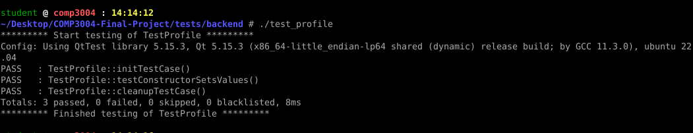
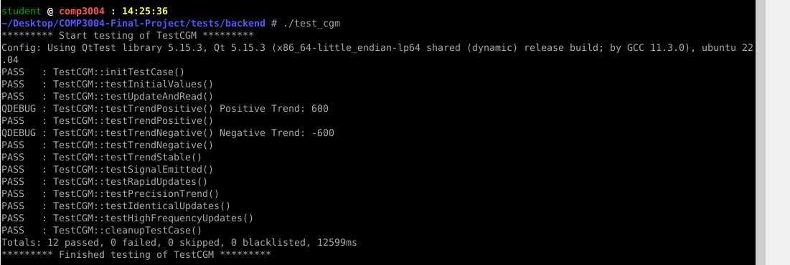
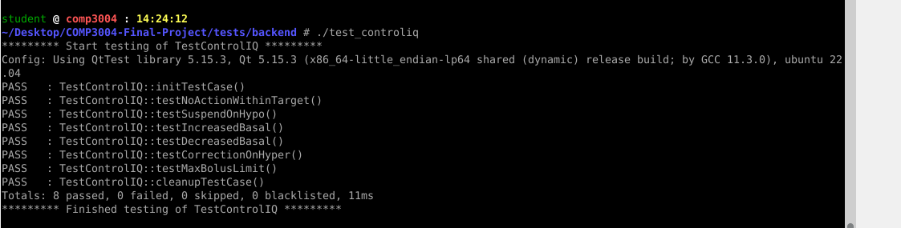
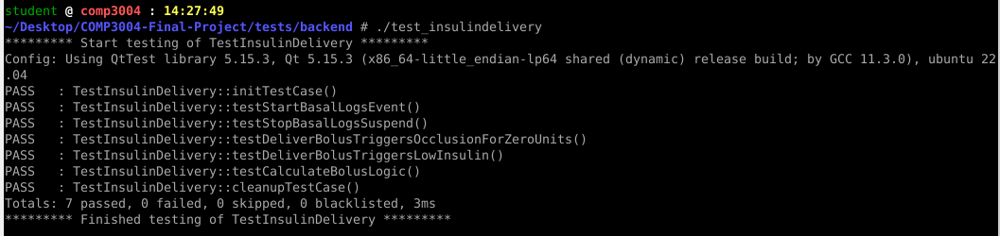
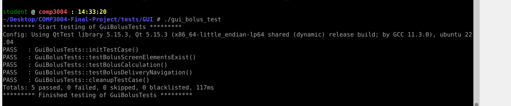

#  Insulin Pump Simulator

A Qt-based C++ simulation of a closed-loop insulin pump system inspired by Control-IQ (like Tandem's t:slim X2), designed for educational and prototyping purposes.

---

##  Features

-  **Continuous Glucose Monitoring (CGM)** with real-time updates and trend analysis
-  **ControlIQ Algorithm** for predictive insulin dosing (basal/bolus adjustments)
-  **Manual Bolus Calculator** for user-entered glucose/carb values
-  **Profile Management** (basal rate, carb ratio, correction factor)
-  **Data Logging** of delivery events with timestamps
-  **Safety Alerts** for occlusion, low battery, low insulin
-  **Qt GUI** with live glucose charts, bolus entry, history, and profile screens
-  **Lock/Unlock PIN Screen**

---

##  Technologies

- **C++17**
- **Qt 5 (Widgets + Charts + Testlib)**
- **Qt Creator** or **command-line builds (qmake, make)**

---

## How to Build & Run the App
- **Option 1: Qt Creator (GUI)**
1) Open 3004_Project.pro in Qt Creator

2) Click Build then Run

- **Option 2: Terminal (CLI)**
1) cd COMP3004-Final-Project
2) qmake
3) make
4) ./3004_Project     # Launches the simulator GUI

## Test Coverage (So Far)
**Profile**

Constructor

Editing

Activation

**CGM**

Device pairing

Glucose updates

Signal emission

**ControlIQ**

Initialization and component linkage

Glucose monitoring integration

Basal rate adjustment logic

**InsulinDelivery** 

Bolus delivery

Quick bolus functionality

IOB (Insulin on Board) tracking

**GUI Bolus Tests**

Bolus UI interaction and state update verification

**AlertSystem**

Low insulin alert trigger

Low battery alert trigger

Occlusion alarm trigger

Alert clearing logic

##  Directory Structure

COMP3004-Final-Project/
├── src/                    # Core application source code (C++/Qt)
│   ├── mainwindow.*        # Main GUI logic
│   ├── PumpSystem.*        # System controller
│   ├── ControlIQ.*         # Automated insulin control logic
│   ├── CGM.*               # Glucose monitoring simulation
│   ├── AlertSystem.*       # Alert and warning logic
│   ├── InsulinDelivery.*   # Insulin delivery system
│   ├── Profile.*           # User-defined insulin profiles
│   └── DataLogger.*        # Bolus history and logging
│
├── tests/
│   ├── backend/            # Unit tests for system logic (QTest)
│   │   ├── test_profile.cpp
│   │   ├── test_cgm.cpp
│   │   ├── test_controliq.cpp
│   │   └── ...
│   └── GUI/                # GUI integration tests (QTest)
│       ├── gui_alert_tests.cpp
│       ├── gui_bolus_tests.cpp
│       └── ...
│
├── 3004_Project.pro        # Qt project file
├── README.md
└── .gitignore

